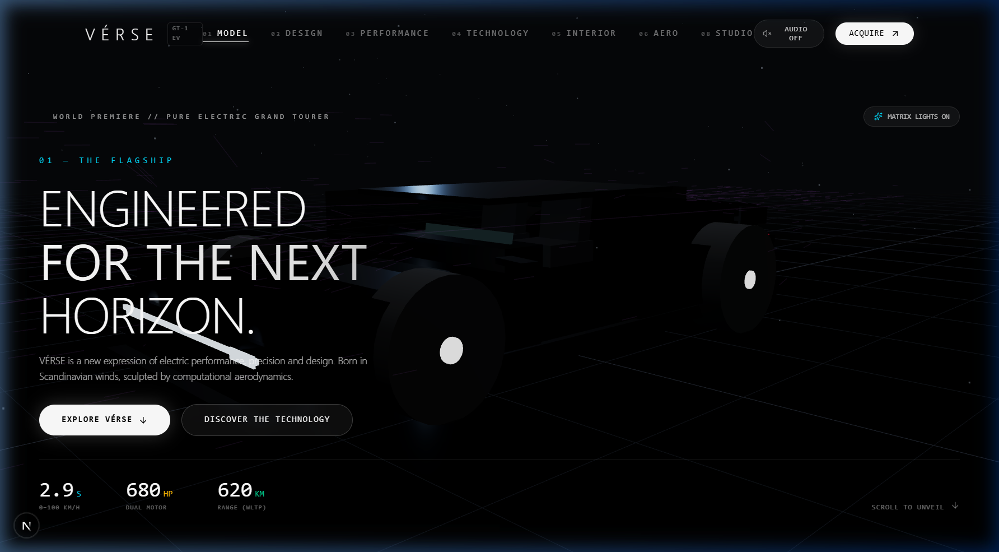
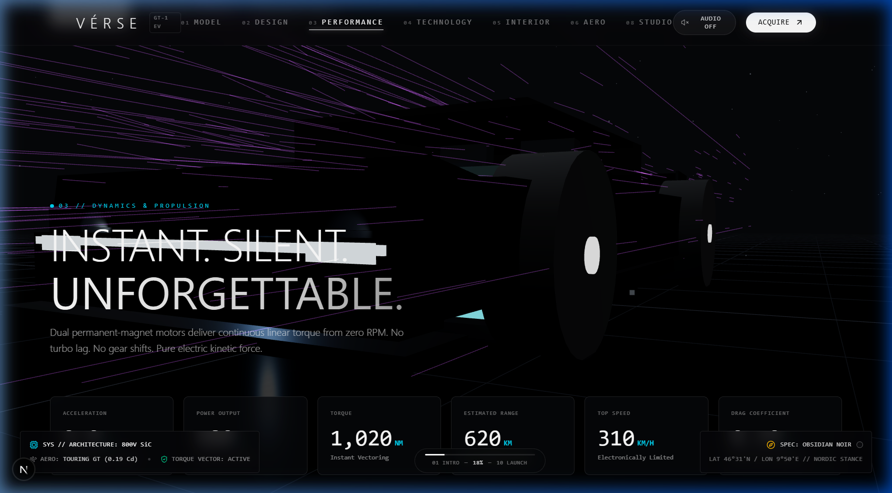
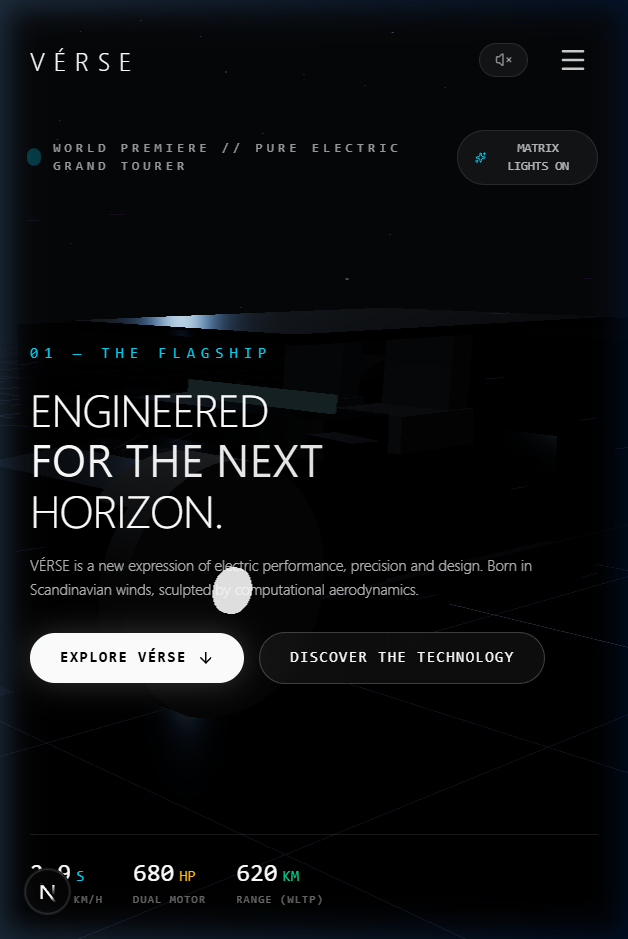
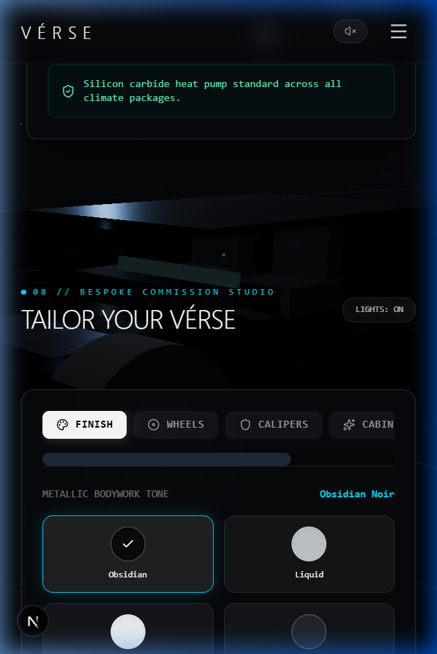

# VÉRSE — Cinematic Automotive Experience

[](https://nextjs.org/)
[](https://react.dev/)
[](https://threejs.org/)
[](https://www.typescriptlang.org/)
[](https://tailwindcss.com/)

> **PROJECT TYPE**: Fictional Creative Concept / Digital Studio Portfolio Project  
> **DISCLAIMER**: VÉRSE is a purely fictional automotive design concept created exclusively for creative coding, 3D WebGL showcase, and portfolio demonstration purposes. All performance figures, vehicle specifications, and acoustic synthesis models are fictional artistic concept metrics.

---

## 🏎️ Overview

**VÉRSE** is an award-level 3D cinematic automotive launch website for a fictional luxury electric performance grand tourer. Designed to transcend conventional automotive landing pages, VÉRSE transforms an automotive commercial into an interactive, real-time WebGL product experience.

Visitors journey through 10 choreographed editorial chapters—from monolithic carbon architecture and instant dual-motor propulsion to active fluid dynamics simulations and a live 360° bespoke commission atelier.

---

## 📸 Screenshots

| Desktop Hero Experience | 3D Vehicle & Aerodynamics |
|:---:|:---:|
|  |  |

| Mobile Responsive Launch | Mobile Bespoke Studio |
|:---:|:---:|
|  |  |

---

## 🌟 Key Features

### 1. 3D WebGL Vehicle Architecture
- **Procedural Carbon & Metallic Shaders**: Real-time physical materials simulating multi-layer metallic flake car paint, high-gloss clearcoat, and smoked glass.
- **Dynamic Exploded Engineering Inspection**: Real-time structural decomposition separating the carbon monocoque chassis, 800V structural battery pack, and dual permanent-magnet motors.
- **Adaptive Studio Environment**: Procedural softbox lighting, dynamic contact ground shadows, micro-dust motes, and reflective floor grid lines.

### 2. Cinematic Camera Choreography
- **Choreographed Perspective Sequences**: Smooth camera transitions synchronized to scroll sections (Low side profile, aggressive front-three-quarter, elevated axonometric view, driver cockpit sanctuary, and distant void retreat).
- **Procedural Camera Breathing**: Subtle organic camera drift and viewport offset damping for cinematic weight.

### 3. Active Aerodynamics & Wind Tunnel
- **Real-Time Streamline Vectors**: Particle streamlines that divert over vehicle contours, cabin rooflines, and rear diffusers.
- **Dynamic Aero Modes**: Switch between **Cruising Mode** (0.19 Cd), **Performance Attack** (Downforce vortex), and **High-Speed Velocity**.

### 4. Bespoke Commission Studio (360° Configurator)
- **Exterior Finishes**: 6 curated metallic tones (Nordic Frost, Obsidian Noir, Liquid Titanium, Hyper Sonic Blue, Monaco Amber, British Racing Green).
- **Forged Rim Assemblies**: Monoblock Aero, Forged Turbine, Carbon Blade.
- **Carbon-Ceramic Calipers & Cabin Themes**: Acid Cyan, Burnt Copper, Pure White, Crimson Track, and Nordic atelier trims.
- **360° Studio Orbit**: Interactive damp-orbit controls in full 3D space.

### 5. Web Audio API Acoustic Engine
- **Harmonic Propulsion Synthesizer**: Binaural harmonic oscillators simulating electric stator magnetic flux chords and progressive torque crescendos.
- **Interactive Launch Control Simulator**: 0–100 km/h acceleration telemetry with instant acoustic feedback and dynamic lateral G-force calculation.

---

## 🛠️ Technology Stack

- **Core Framework**: [Next.js 16.3 (App Router with Turbopack)](https://nextjs.org/)
- **UI & State**: [React 19](https://react.dev/), [TypeScript](https://www.typescriptlang.org/)
- **3D Graphics & Shaders**: [Three.js](https://threejs.org/), [@react-three/fiber](https://docs.pmnd.rs/react-three-fiber), [@react-three/drei](https://github.com/pmndrs/drei)
- **Smooth Inertia Scrolling**: [Lenis](https://lenis.darkroom.engineering/)
- **Micro-Animations & Gestures**: [Framer Motion](https://www.framer.com/motion/)
- **Styling & Design System**: [Tailwind CSS v4](https://tailwindcss.com/)
- **Audio Synthesizer**: Native [Web Audio API](https://developer.mozilla.org/en-US/docs/Web/API/Web_Audio_API)
- **Icons & Visuals**: [Lucide React](https://lucide.dev/), [Canvas-Confetti](https://www.npmjs.com/package/canvas-confetti)

---

## ⚡ Performance Optimizations

- **Adaptive DPR & Hardware Scaling**: Dynamic pixel-ratio scaling (`[1, 1.3]` on mobile, `[1, 1.8]` on desktop) preventing GPU thermal throttling.
- **Tab Visibility Throttling**: Automatically pauses WebGL frame loops when tabs are inactive (`frameloop="never"`).
- **Zero-Allocation Camera Loops**: Reuses persistent vector references to eliminate GC garbage collection pause spikes.
- **GPU Composite Transforms**: Cursor, motion values, and audio frequency visualizers execute strictly on GPU layers (`transform: scaleY / translate3d`).
- **Layout Thrashing Elimination**: Section geometry metrics and scroll bounds are cached and read from Lenis events without triggering synchronous layout reflows.

---

## 🚀 Getting Started

### Prerequisites
- Node.js 18.18+ or 20+
- npm, yarn, or pnpm

### Installation

1. **Clone the repository**:
   ```bash
   git clone https://github.com/hellokineticweb/verse-automotive.git
   cd verse-automotive
   ```

2. **Install dependencies**:
   ```bash
   npm install
   ```

3. **Start the development server**:
   ```bash
   npm run dev
   ```

4. **Open in browser**:
   Navigate to [http://localhost:3000](http://localhost:3000)

### Production Build

```bash
npm run build
npm run start
```

---

## ⚙️ Environment Variables

Copy the example environment configuration:

```bash
cp .env.example .env.local
```

| Variable | Description | Default |
|:---|:---|:---|
| `NEXT_PUBLIC_APP_URL` | Application root URL | `http://localhost:3000` |
| `NEXT_PUBLIC_SITE_NAME` | Website metadata brand title | `VÉRSE Automotive` |

---

## 📋 Concept Specifications (Fictional)

| Metric | Specification |
|:---|:---|
| **Acceleration (0–100 km/h)** | 2.9 Seconds |
| **Powertrain** | Dual Synchronous Permanent-Magnet Motors |
| **Peak Output** | 680 Horsepower (500 kW) |
| **Architecture** | 800V Silicon Carbide (SiC) Bus |
| **Battery Capacity** | 118 kWh Structural Solid-Core Pack |
| **Aerodynamic Drag** | 0.19 Cd (Active Cruise Configuration) |
| **DC Fast Charging** | 350 kW (10% to 80% in 18 minutes) |
| **Chassis Rigidity** | 48,000 Nm/deg Torsional Stiffness |

---

## 📄 License & Disclaimer

This project is released under the **MIT License**.

### Legal Disclaimer
**VÉRSE** is a fictional creative concept and showcase created solely for design, creative coding, and portfolio demonstration. VÉRSE is not an existing automotive manufacturer, product, or commercial vehicle. No real automotive partnerships, trademarks, or certified engineering performance results are claimed or implied.

---

## 👥 Credits

- **Design & Creative Direction**: Creative Engineering Portfolio
- **Development**: Next.js, React, Three.js, Lenis, Framer Motion
- **Repository**: [https://github.com/hellokineticweb/verse-automotive](https://github.com/hellokineticweb/verse-automotive)
